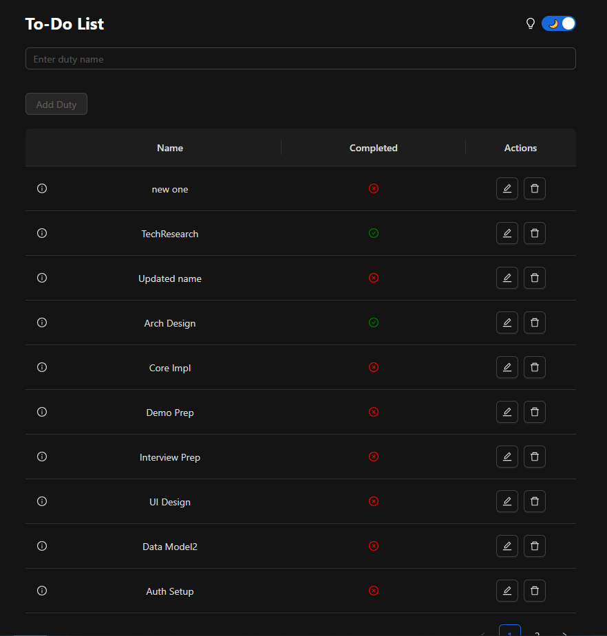

# TODO Task Manager - Full Stack Application

A complete end-to-end to-do list application built with React, TypeScript, Node.js, Express, and PostgreSQL. This application follows best practices for scalability, observability, and maintainability.



## Features

- ✅ Create, read, update, and delete todo items
- ✅ Form validations for data integrity
- ✅ PostgreSQL database with raw SQL queries (no ORM)
- ✅ TypeScript in strict mode for both frontend and backend
- ✅ Complete test coverage with Jest
- ✅ Dockerized development environment
- ✅ Logging and observability features
- ✅ API documentation with Swagger

## Architecture

The application follows a clean, scalable architecture:

```
project-root/
├── .github/                # CI/CD workflow templates
├── docs/                   # Documentation
├── backend/                # Node.js Express API
│   ├── src/                # Source code
│   │   ├── config/         # Configuration files
│   │   ├── controllers/    # Request handlers
│   │   ├── middlewares/    # Express middlewares
│   │   ├── models/         # Data models
│   │   ├── repositories/   # Database access layer
│   │   ├── services/       # Business logic
│   │   └── utils/          # Utility functions
│   ├── logs/               # Application logs
│   └── tests/              # Backend tests
└── frontend/               # React application
    ├── public/             # Static files
    └── src/                # Source code
        └── components/     # React components
```

## Prerequisites

- Docker and Docker Compose
- Node.js 18+
- npm 9+

## Getting Started

### Clone the repository

```bash
git clone https://github.com/GuilleRoman/Apeiroo.git
cd Apeiroo
```

### Running with Docker

The easiest way to run the application is using Docker Compose:
Use two terminals to run the backend and front end simultaneously.
```bash
# Start backend (terminal 1)
cd backend
docker-compose up --build 

# Start frontend (terminal 2)
cd frontend
npm start
```

This will:
1. Set up the PostgreSQL database with initial schema
2. Start the backend API server on port 3001
3. Start the frontend development server on port 3000

### Manual Setup

#### Backend

```bash
cd backend

# Install dependencies
npm install

# Set up environment variables
cp .env.example .env
# Edit .env with your database credentials

# Run database migrations
# (Database should be up and running first)

# Start development server
npm run dev
```

The backend will be running at http://localhost:3001

#### Frontend

```bash
cd frontend

# Install dependencies
npm install

# Start development server
npm start
```

The frontend will be running at http://localhost:3000

## Database Setup

The application uses PostgreSQL. The initial schema is created automatically when using Docker Compose through the `init.sql` file.

If setting up manually, you can create the database and tables by running:

```bash
psql -U postgres -f backend/init.sql
```

## Testing

### Backend Tests

```bash
cd backend
npm test
```

### Frontend Tests

```bash
cd frontend
npm test
```

## API Documentation

API documentation is available via Swagger UI at:

```
http://localhost:3001/api-docs
```

## Observability

The application includes a comprehensive observability strategy:

- **Logging**: Structured JSON logs stored in the `backend/logs` directory
- **Metrics**: Performance monitoring setup documented in `docs/observability.md`


For more details, see the [Observability Documentation](./docs/observability.md).

## Future Enhancements

- Health Checks: Endpoints to display server's healthiness at something like this =>  `http://localhost:3001/health`

The application is designed for scalability with the following enhancements planned:

- Microservices architecture
- Caching layer with Redis
- Automated CI/CD pipeline
- Containerized production deployment
- Enhanced monitoring and alerting

## Contributing

1. Fork the repository
2. Create your feature branch (`git checkout -b feature/incredible-feature`)
3. Commit your changes (`git commit -m 'Add some amazing feature'`)
4. Push to the branch (`git push origin feature/incredible-feature`)
5. Open a Pull Request

## License

This project is licensed under the MIT License - see the LICENSE file for details.